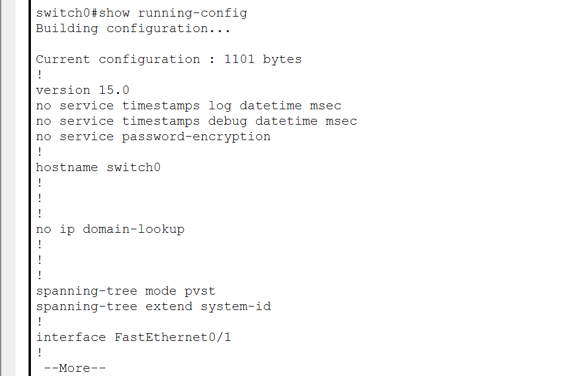
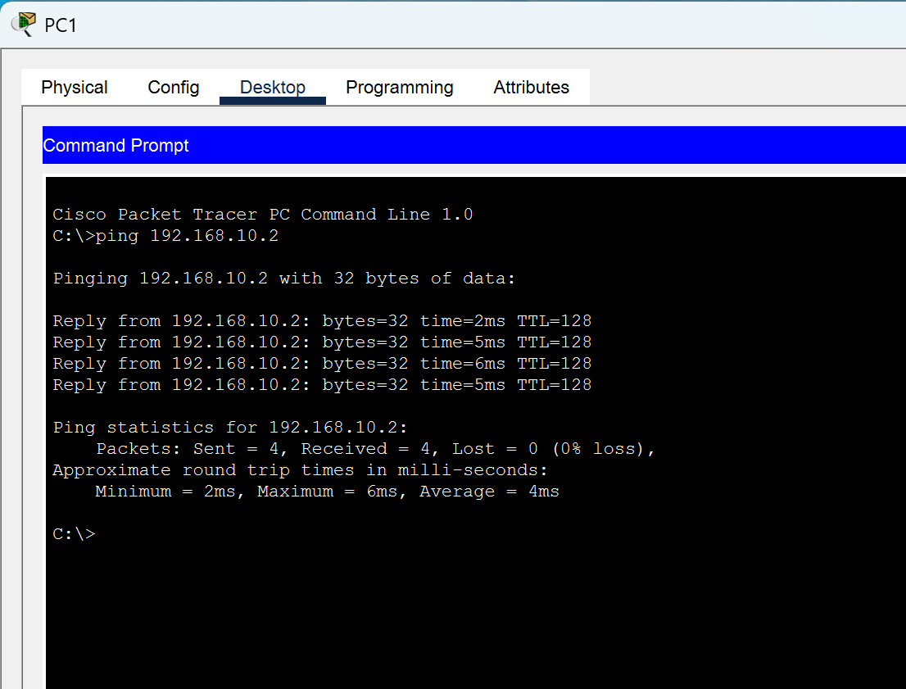
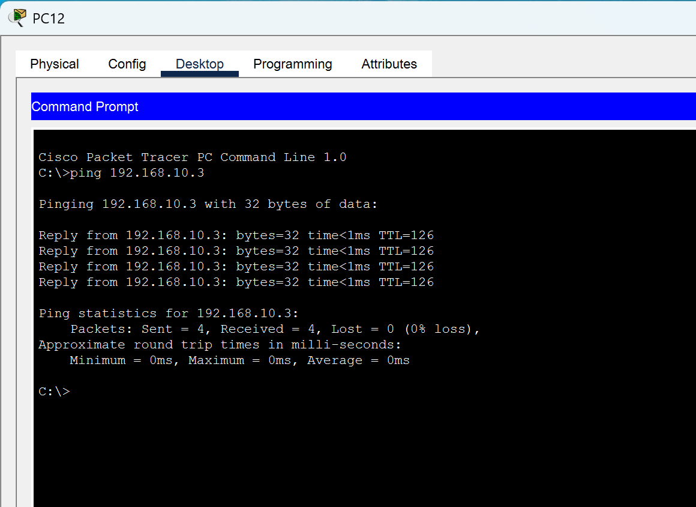
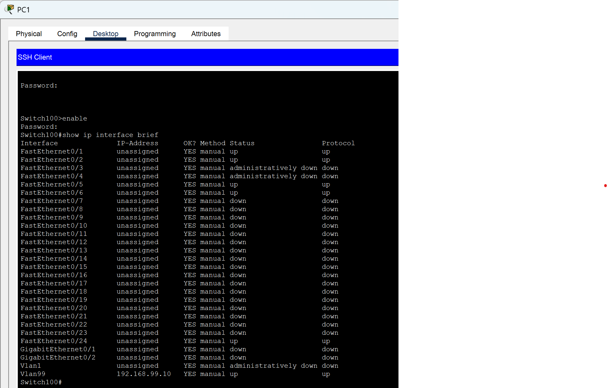
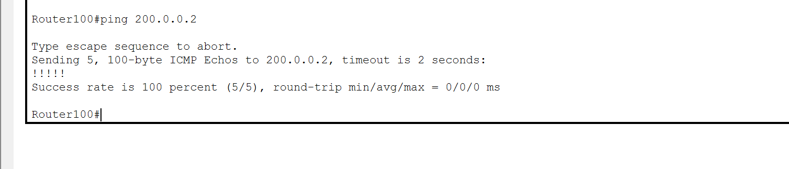

# Enterprise Network Lab using Cisco Packet Tracer

This project demonstrates the design and configuration of an enterprise-style network using:
- VLAN segmentation
- Inter-VLAN routing (Router-on-a-Stick)
- DHCP automation
- ACL security
- SSH remote management
- Static routing
- NAT for WAN access

All configurations were implemented and tested in Cisco Packet Tracer.

## Network Topology

The following diagram represents the full network topology, including VLAN segments, trunk links, routers, switches, and the WAN connection.

## Device Configurations
### Switch100 Configuration

This switch acts as the core switch for the left-side network segment.
It handles VLAN segmentation for VLAN 10 and VLAN 99, and it also provides the uplink to the router.
	•	Connects directly to Router100 for inter-VLAN routing
	•	Provides a trunk connection to Switch200
	•	Carries VLANs 10, 20, and 99 over the trunk link
  

### Switch200 Configuration

This access switch serves VLAN 20 on the left-side network segment.

- Receives a trunk link from Switch100 on Fa0/1 (VLANs 10, 20, and 99 allowed).
- Provides access ports for PCs in VLAN 20 (PC3 and PC4).
- Extends the same VLAN segmentation from the core switch to the edge devices.

### Router100 Configuration

This router provides inter-VLAN routing, DHCP services, and WAN connectivity for all left-side VLANs.  
It also performs NAT to allow internal VLANs to reach the WAN via Router1.

Key responsibilities:
- Acts as the default gateway for *VLAN 10, VLAN 20, and VLAN 99*.
- Performs inter-VLAN routing using subinterfaces (Router-on-a-Stick).
- Provides DHCP services for the following VLAN subnets:
  - 192.168.10.0/24 (VLAN 10)
  - 192.168.20.0/24 (VLAN 20)
  - 192.168.99.0/24 (Management VLAN – VLAN 99)
- Uses *200.0.0.1* as its WAN interface address.
- Connects to Router1 for WAN communication.
- Translates internal private IP addresses to the WAN IP using NAT overload (PAT).

DHCP pools served by Router100:
- *192.168.10.0/24* – clients in VLAN 10
- *192.168.20.0/24* – clients in VLAN 20
- *192.168.99.0/24* – management devices in VLAN 99

### Router1 Configuration

Router1 provides WAN connectivity for the right-side network and routes traffic between the right-side LAN (VLAN50) and Router100.  
It also receives static routes from Router100 that allow full communication between all VLANs.

Key responsibilities:
- Connects to Router100 over the WAN link.
- Acts as the *default gateway* for the VLAN50 subnet.
- Provides *DHCP services* for VLAN50.
- Forwards traffic between VLAN50 and all left-side VLANs (10, 20, 99).
- Uses WAN IP address *200.0.0.2*, which communicates with Router100’s 200.0.0.1.
- Supports NAT traffic from Router100 (outside interface is on this router).

DHCP pool served by Router1:
- *192.168.50.0/24* — PCs on the right-side LAN (VLAN50)

### Switch0 Configuration

This access switch serves VLAN 50 on the right-side network segment.

Key functions:
- Receives an uplink from Router1 on *Gig0/1* (carrying VLAN 50).
- Provides access ports for PCs in VLAN 50 (PC11 and PC12).
- Extends Layer 2 connectivity for the right-side network segment.

## Testing & Verification

This section shows the key tests that were performed to verify connectivity, routing, SSH management and management VLAN isolation.

### 1. PC-to-PC Connectivity (Same VLAN)

- *PC1 → PC4* (VLAN10 – left-side LAN)  
  Successful ping proving basic Layer 3 connectivity within VLAN10.

### 2. Inter-VLAN & WAN Connectivity (Left ↔ Right Side)

- *PC2 → PC11* (VLAN20 → VLAN50, across the WAN link)  
  Confirms that inter-VLAN routing on Router100 and the WAN link to Router1 work correctly.

- *PC12 → PC1* (VLAN50 → VLAN10, across the WAN link)  
  Shows that traffic from the right-side LAN can reach the left-side VLANs via the WAN.

### 3. Management VLAN (VLAN99) Isolation

- *PC1 → 192.168.99.10 (Switch100 SVI – VLAN99)*  
  Ping fails with Destination host unreachable, showing that the ACL on Router100 successfully blocks user VLANs from reaching the management VLAN.

### 4. SSH Remote Management

- *SSH from PC1 to Switch100*  
  show ip interface brief output over SSH, confirming:
  - VLAN99 SVI has IP address 192.168.99.10
  - Trunk and access ports are up and correctly assigned to VLANs 10, 20, and 99.

### 5. WAN Link Verification (Router100 ↔ Router1)

- *Router1 → Router100 (200.0.0.1)*  
  Successful ping showing that Router1 reaches Router100 over the WAN.

- *Router100 → Router1 (200.0.0.2)*  
  Successful ping showing bidirectional connectivity on the WAN link.

### 6. Core Switch Configuration (Switch100)

The following screenshots capture the full running configuration for Switch100, split into two parts:

- *Switch100 Show Run – Part 1*  
  General settings, usernames, SSH, VLAN access ports and trunk ports.

- *Switch100 Show Run – Part 2*  
  VLAN99 SVI (192.168.99.10), default gateway, and VTY lines configured for SSH access.

