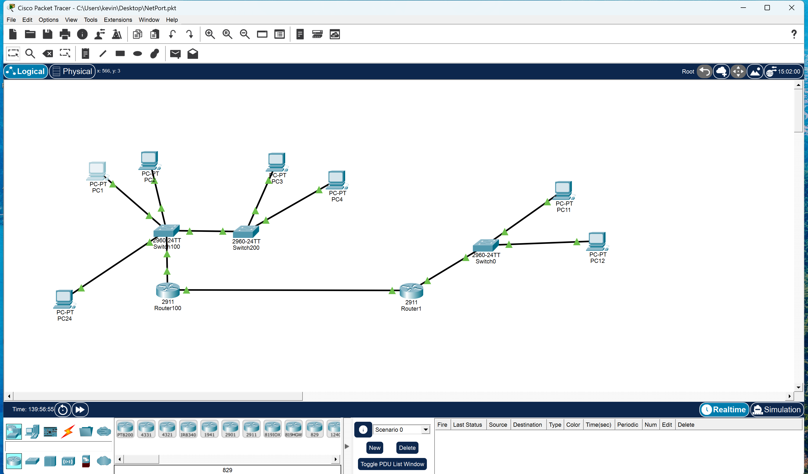
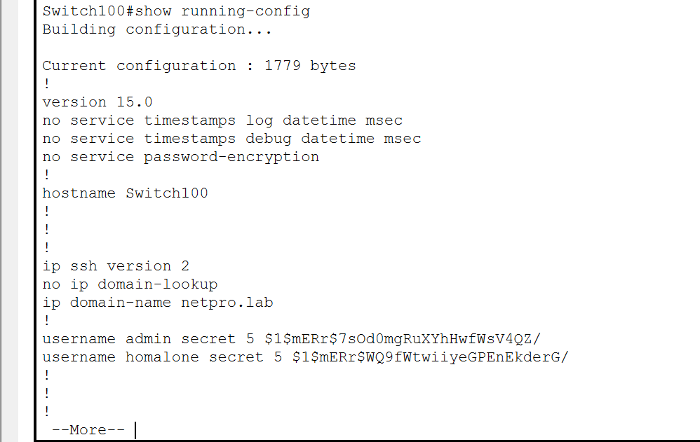
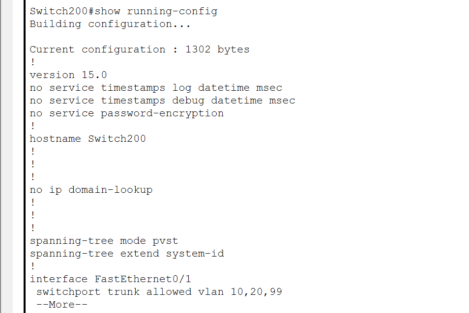
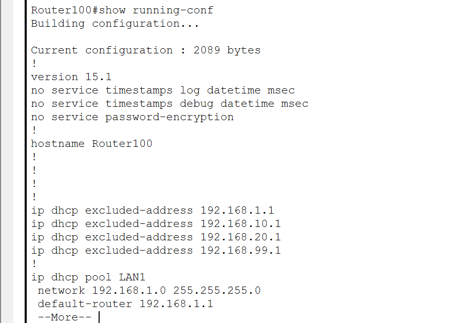

# Enterprise Network Lab using Cisco Packet Tracer

This project demonstrates the design and configuration of an enterprise-style network using:
- VLAN segmentation
- Inter-VLAN routing (Router-on-a-Stick)
- DHCP automation
- ACL security
- SSH remote management
- Static routing
- NAT for WAN access

All configurations were implemented and tested in Cisco Packet Tracer.

## Network Topology

The following diagram represents the full network topology, including VLAN segments, trunk links, routers, switches, and the WAN connection.

## Device Configurations
### Switch100 Configuration

This switch acts as the core switch for the left-side network segment.
It handles VLAN segmentation for VLAN 10 and VLAN 99, and it also provides the uplink to the router.
	•	Connects directly to Router100 for inter-VLAN routing
	•	Provides a trunk connection to Switch200
	•	Carries VLANs 10, 20, and 99 over the trunk link
  

### Switch200 Configuration

This access switch serves VLAN 20 on the left-side network segment.

- Receives a trunk link from Switch100 on Fa0/1 (VLANs 10, 20, and 99 allowed).
- Provides access ports for PCs in VLAN 20 (PC3 and PC4).
- Extends the same VLAN segmentation from the core switch to the edge devices.

### Router100 Configuration

This router provides inter-VLAN routing, DHCP services, and WAN connectivity for all left-side VLANs.  
It also performs NAT to allow internal VLANs to reach the WAN via Router1.

Key responsibilities:
- Acts as the default gateway for *VLAN 10, VLAN 20, and VLAN 99*.
- Performs inter-VLAN routing using subinterfaces (Router-on-a-Stick).
- Provides DHCP services for the following VLAN subnets:
  - 192.168.10.0/24 (VLAN 10)
  - 192.168.20.0/24 (VLAN 20)
  - 192.168.99.0/24 (Management VLAN – VLAN 99)
- Uses *200.0.0.1* as its WAN interface address.
- Connects to Router1 for WAN communication.
- Translates internal private IP addresses to the WAN IP using NAT overload (PAT).

DHCP pools served by Router100:
- *192.168.10.0/24* – clients in VLAN 10
- *192.168.20.0/24* – clients in VLAN 20
- *192.168.99.0/24* – management devices in VLAN 99

